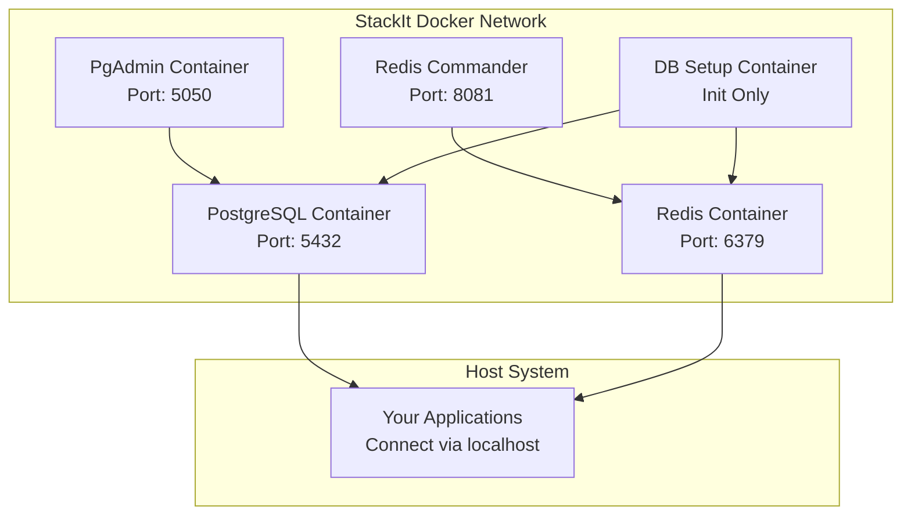

# StackIt Docker Containerization Guide

Complete Docker setup for StackIt backend databases and services with development and production configurations.

## 📋 Table of Contents

- [Overview](#overview)
- [Quick Start](#quick-start)
- [Architecture](#architecture)
- [Installation](#installation)
- [Development Setup](#development-setup)
- [Production Setup](#production-setup)
- [Docker Management](#docker-management)
- [Services](#services)
- [Networking](#networking)
- [Data Persistence](#data-persistence)
- [Monitoring](#monitoring)
- [Troubleshooting](#troubleshooting)
- [Advanced Usage](#advanced-usage)

## 🎯 Overview

The StackIt Docker setup provides:

- **PostgreSQL**: Two databases (users, content) with full schema and notification system
- **Redis**: Multi-database setup for sessions, cache, notifications, and analytics
- **Development Tools**: PgAdmin, Redis Commander for easy management
- **Production Ready**: Optimized configurations, monitoring, and backup solutions
- **One-Click Setup**: Automated initialization and testing

### Key Benefits

✅ **Consistent Environment**: Same setup across development, testing, and production  
✅ **Isolated Dependencies**: No local PostgreSQL/Redis installation required  
✅ **Easy Management**: Simple scripts for all operations  
✅ **Development Tools**: Built-in database administration interfaces  
✅ **Production Ready**: Optimized for performance and security  
✅ **Backup & Recovery**: Automated backup solutions  

## 🚀 Quick Start

### Prerequisites

1. **Docker**: Install Docker Desktop or Docker Engine
   ```bash
   # Check Docker installation
   docker --version
   docker-compose --version  # or docker compose version
   ```

2. **Clone and Navigate**:
   ```bash
   cd stackit/backend
   ```

### One-Command Setup

```bash
# Initialize and start development environment
./docker.sh setup
./docker.sh up dev
```

That's it! Your complete database infrastructure is now running with:
- PostgreSQL with initialized schemas
- Redis with optimized configuration
- PgAdmin at http://localhost:5050
- Redis Commander at http://localhost:8081

## 🏗️ Architecture

### Container Overview



### Database Structure

#### PostgreSQL Databases
- **`stackit_users`**: User authentication, profiles, preferences
- **`stackit_content`**: Questions, answers, votes, comments, notifications

#### Redis Databases
- **DB 0**: Session storage and authentication tokens
- **DB 1**: Application cache and computed data
- **DB 2**: Notification queues and real-time features
- **DB 3**: Vote tracking and analytics

## 📦 Installation

### 1. Environment Setup

```bash
# Copy environment template
cp .env.example .env

# Edit configuration (optional for development)
nano .env
```

### 2. Initialize Project

```bash
# Setup directories, secrets, and permissions
./docker.sh setup
```

This creates:
- Docker volume directories
- Production secrets (auto-generated)
- Proper file permissions
- Environment configuration

### 3. Start Services

```bash
# Development environment (with admin tools)
./docker.sh up dev

# Or production environment
./docker.sh up prod
```

## 🛠️ Development Setup

### Starting Development Environment

```bash
# Start with all development tools
./docker.sh dev

# Check status
./docker.sh status
```

Development environment includes:
- PostgreSQL with development optimizations
- Redis with verbose logging
- **PgAdmin**: Web-based PostgreSQL administration
- **Redis Commander**: Web-based Redis management
- **Hot reloading**: For database schema changes
- **Detailed logging**: For debugging

### Development Access

| Service | URL | Credentials |
|---------|-----|-------------|
| **PgAdmin** | http://localhost:5050 | admin@stackit.local / admin123 |
| **Redis Commander** | http://localhost:8081 | admin / admin123 |
| **PostgreSQL** | localhost:5432 | stackit_user / stackit_password |
| **Redis** | localhost:6379 | (no password) |

### Database Connections

```javascript
// PostgreSQL connection for your apps
const dbConfig = {
    host: 'localhost',        // or 'postgres' from inside containers
    port: 5432,
    user: 'stackit_user',
    password: 'stackit_password',
    database: 'stackit_content'  // or 'stackit_users'
};

// Redis connection
const redisConfig = {
    host: 'localhost',        // or 'redis' from inside containers
    port: 6379,
    db: 2                     // for notifications
};
```

### Development Workflow

```bash
# Daily development commands
./docker.sh dev          # Start everything
./docker.sh logs         # Watch all logs
./docker.sh db-shell     # Quick database access
./docker.sh redis-cli    # Quick Redis access
./docker.sh test         # Test connections
./docker.sh dev-down     # Stop when done
```

## 🚀 Production Setup

### Production Environment

```bash
# Start production services
./docker.sh prod

# Check health
./docker.sh health
```

Production features:
- **Optimized configurations** for performance
- **Security hardened** with secrets management
- **Resource limits** and monitoring
- **Automated backups**
- **Health checks**

### Production Security

1. **Secrets Management**:
   ```bash
   # Auto-generated secrets (during setup)
   secrets/postgres_admin_password.txt
   secrets/redis_password.txt
   ```

2. **Network Security**:
   - Containers isolated in private network
   - Only necessary ports exposed
   - No development tools in production

3. **Data Security**:
   - Persistent volumes with proper permissions
   - Regular automated backups
   - Database user separation

### Production Monitoring

```bash
# Enable monitoring services
docker-compose -f docker-compose.yml -f docker-compose.prod.yml --profile monitoring up -d

# Access metrics
curl http://localhost:9187/metrics  # PostgreSQL metrics
curl http://localhost:9121/metrics  # Redis metrics
```

## 🎮 Docker Management

### The Docker Management Script

The `docker.sh` script provides all necessary operations:

#### Basic Operations
```bash
./docker.sh up [dev|prod]     # Start services
./docker.sh down [dev|prod]   # Stop services
./docker.sh restart [dev|prod] # Restart services
./docker.sh status            # Show container status
./docker.sh logs [service]    # Show logs
./docker.sh monitor           # Real-time stats
```

#### Development Commands
```bash
./docker.sh dev               # Start dev environment
./docker.sh dev-logs          # Show dev logs
./docker.sh shell postgres    # Open container shell
./docker.sh db-shell          # Open PostgreSQL shell
./docker.sh redis-cli         # Open Redis CLI
```

#### Maintenance Commands
```bash
./docker.sh clean             # Remove all containers/volumes
./docker.sh reset             # Clean and rebuild
./docker.sh backup            # Backup databases
./docker.sh update            # Update to latest images
./docker.sh test              # Test connections
```

#### Advanced Commands
```bash
./docker.sh build --no-cache  # Rebuild without cache
./docker.sh up --env=prod     # Force environment
./docker.sh clean --force     # Skip confirmation
./docker.sh --verbose logs    # Verbose output
```

### Manual Docker Compose

If you prefer using docker-compose directly:

```bash
# Development
docker-compose -f docker-compose.yml -f docker-compose.dev.yml up -d --profile dev

# Production
docker-compose -f docker-compose.yml -f docker-compose.prod.yml up -d

# Stop
docker-compose down
```

## 🔧 Services

### PostgreSQL Container

**Image**: `postgres:15-alpine`  
**Container**: `stackit_postgres`  
**Port**: `5432`

Features:
- **Auto-initialization** with databases and schemas
- **Performance tuned** configurations
- **Health checks** for reliability
- **Volume persistence** for data safety

Configuration locations:
- Init scripts: `docker/postgres/init/`
- Setup scripts: `docker/postgres/setup/`
- PgAdmin config: `docker/postgres/pgadmin-servers.json`

### Redis Container

**Image**: `redis:7-alpine`  
**Container**: `stackit_redis`  
**Port**: `6379`

Features:
- **Multi-database** setup (0-3)
- **Optimized configurations** per environment
- **Persistence** with AOF and RDB
- **Memory management** with LRU eviction

Configuration files:
- Development: `docker/redis/redis-dev.conf`
- Production: `docker/redis/redis-prod.conf`

### Management Containers

#### PgAdmin (Development Only)
- **URL**: http://localhost:5050
- **Credentials**: admin@stackit.local / admin123
- **Pre-configured** with StackIt databases

#### Redis Commander (Development Only)
- **URL**: http://localhost:8081
- **Credentials**: admin / admin123
- **Access to all** Redis databases

#### Database Setup Container
- **Purpose**: One-time initialization
- **Function**: Creates schemas, triggers, sample data
- **Auto-runs**: On first startup

## 🌐 Networking

### Docker Network

All containers communicate via the `stackit_network` bridge network:

```yaml
# Internal container communication
postgres:5432    # PostgreSQL
redis:6379       # Redis
```

### Port Mapping

| Service | Internal Port | External Port | Purpose |
|---------|---------------|---------------|---------|
| PostgreSQL | 5432 | 5432 | Database access |
| Redis | 6379 | 6379 | Cache/sessions |
| PgAdmin | 80 | 5050 | DB management |
| Redis Commander | 8081 | 8081 | Redis management |

### Application Connections

From your applications:

```bash
# Local development (outside containers)
DB_HOST=localhost
REDIS_HOST=localhost

# Container-to-container (if app is containerized)
DB_HOST=postgres
REDIS_HOST=redis
```

## 💾 Data Persistence

### Volume Management

#### Development Volumes
```bash
# Local bind mounts for easy access
./docker/volumes/postgres_dev/
./docker/volumes/redis_dev/
```

#### Production Volumes
```bash
# Named Docker volumes for performance
stackit_postgres_prod_data
stackit_redis_prod_data
stackit_backup_data
```

### Backup Strategy

#### Automated Backups (Production)
```bash
# Backup service runs daily
# Retention: 30 days
# Location: /var/lib/stackit/backups
```

#### Manual Backups
```bash
# Create backup
./docker.sh backup

# Backups stored in:
./docker/volumes/backups/YYYYMMDD_HHMMSS/
├── stackit_users.sql
├── stackit_content.sql
└── redis_dump.rdb
```

#### Restore Process
```bash
# Stop services
./docker.sh down

# Restore from backup
docker run --rm -v $(pwd)/backups:/backups \
  -v stackit_postgres_data:/var/lib/postgresql/data \
  postgres:15-alpine sh -c "
    rm -rf /var/lib/postgresql/data/*
    pg_basebackup -h backup_host -D /var/lib/postgresql/data
  "

# Restart services
./docker.sh up
```

## 📊 Monitoring

### Health Checks

All services include health checks:

```bash
# Check health status
docker ps  # See health status
./docker.sh status  # Detailed status

# Manual health checks
docker exec stackit_postgres pg_isready
docker exec stackit_redis redis-cli ping
```

### Resource Monitoring

```bash
# Real-time monitoring
./docker.sh monitor

# Resource usage
docker stats stackit_postgres stackit_redis

# Logs monitoring
./docker.sh logs  # All services
./docker.sh logs postgres  # Specific service
```

### Performance Metrics (Production)

With monitoring profile enabled:

```bash
# Start with monitoring
docker-compose -f docker-compose.yml -f docker-compose.prod.yml --profile monitoring up -d

# PostgreSQL metrics
curl http://localhost:9187/metrics

# Redis metrics
curl http://localhost:9121/metrics
```

## 🔍 Troubleshooting

### Common Issues

#### Services Won't Start

1. **Port conflicts**:
   ```bash
   # Check what's using the ports
   lsof -i :5432  # PostgreSQL
   lsof -i :6379  # Redis
   
   # Stop conflicting services
   brew services stop postgresql  # macOS
   sudo systemctl stop redis-server  # Linux
   ```

2. **Permission issues**:
   ```bash
   # Fix permissions
   sudo chown -R $(whoami) docker/volumes/
   ./docker.sh setup  # Re-run setup
   ```

3. **Docker daemon issues**:
   ```bash
   # Restart Docker
   # macOS: Restart Docker Desktop
   # Linux: sudo systemctl restart docker
   ```

#### Database Connection Issues

1. **Check container status**:
   ```bash
   ./docker.sh status
   docker logs stackit_postgres
   ```

2. **Test connections**:
   ```bash
   ./docker.sh test
   ./docker.sh db-shell  # Direct connection test
   ```

3. **Network issues**:
   ```bash
   # Check network
   docker network ls | grep stackit
   docker network inspect stackit_network
   ```

#### Performance Issues

1. **Resource constraints**:
   ```bash
   # Check resources
   docker stats
   
   # Increase Docker memory (Docker Desktop settings)
   # Recommended: 4GB+ RAM for development
   ```

2. **Disk space**:
   ```bash
   # Check disk usage
   docker system df
   
   # Clean up
   ./docker.sh prune
   ```

### Debug Mode

Enable verbose logging:

```bash
# Verbose Docker operations
./docker.sh --verbose up dev

# Database debug logs
# Edit docker-compose.dev.yml:
command: postgres -c log_statement=all
```

### Getting Help

```bash
# Show all available commands
./docker.sh help

# Service-specific help
docker logs stackit_postgres
docker exec stackit_postgres pg_isready --help
```

## 🔬 Advanced Usage

### Custom Configurations

#### PostgreSQL Tuning

Edit `docker-compose.yml` or `docker-compose.prod.yml`:

```yaml
postgres:
  command: >
    postgres
    -c shared_buffers=256MB
    -c max_connections=200
    -c effective_cache_size=1GB
```

#### Redis Optimization

Edit `docker/redis/redis.conf`:

```conf
# Memory settings
maxmemory 512mb
maxmemory-policy allkeys-lru

# Persistence settings
save 900 1
appendonly yes
```

### Multi-Environment Setup

```bash
# Environment-specific configs
cp docker-compose.dev.yml docker-compose.staging.yml

# Run staging environment
docker-compose -f docker-compose.yml -f docker-compose.staging.yml up -d
```

### Integration with CI/CD

```yaml
# .github/workflows/test.yml
name: Database Tests
on: [push, pull_request]

jobs:
  test:
    runs-on: ubuntu-latest
    steps:
      - uses: actions/checkout@v2
      - name: Start databases
        run: |
          ./backend/docker.sh up dev
          ./backend/docker.sh test
```

### Scaling for Production

#### Database Clustering
```yaml
# docker-compose.cluster.yml
postgres_primary:
  image: postgres:15-alpine
postgres_replica:
  image: postgres:15-alpine
  depends_on:
    - postgres_primary
```

#### Redis Clustering
```yaml
redis_cluster:
  image: redis:7-alpine
  command: redis-server --cluster-enabled yes
```

### Development Shortcuts

```bash
# Add to your ~/.bashrc or ~/.zshrc
alias stackit-up='cd /path/to/stackit/backend && ./docker.sh up dev'
alias stackit-down='cd /path/to/stackit/backend && ./docker.sh down'
alias stackit-logs='cd /path/to/stackit/backend && ./docker.sh logs'
alias stackit-db='cd /path/to/stackit/backend && ./docker.sh db-shell'
alias stackit-redis='cd /path/to/stackit/backend && ./docker.sh redis-cli'
```

### Database Migrations with Docker

```bash
# Run migrations in container
docker exec stackit_postgres psql -U stackit_user -d stackit_content -f /scripts/migration_001.sql

# Or use the setup container
docker run --rm \
  --network stackit_network \
  -v $(pwd)/database/migrations:/migrations \
  postgres:15-alpine \
  psql -h postgres -U stackit_user -d stackit_content -f /migrations/001_add_new_table.sql
```

## 📚 Additional Resources

### Documentation Links
- [Docker Documentation](https://docs.docker.com/)
- [Docker Compose Reference](https://docs.docker.com/compose/)
- [PostgreSQL Docker Official Image](https://hub.docker.com/_/postgres)
- [Redis Docker Official Image](https://hub.docker.com/_/redis)

### StackIt-Specific Docs
- [Database Schema Guide](./database/README.md)
- [Notification System Guide](./database/NOTIFICATION_GUIDE.md)
- [API Documentation](./README.md)

### Community Support
- [StackIt GitHub Issues](https://github.com/bismuth01/stackit/issues)
- [Docker Community Forums](https://forums.docker.com/)

---

Start with `./docker.sh up dev` and begin building your application with confidence that your data layer is robust, scalable, and production-ready.